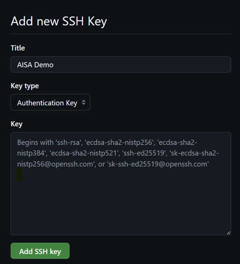
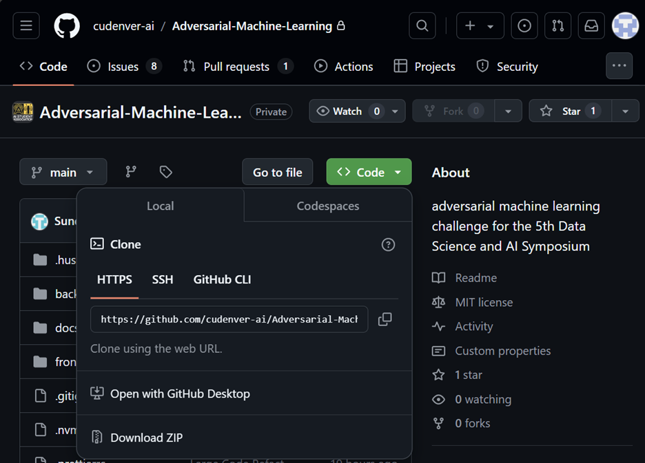

# Documentation for SetUp
## Setup Git in Your System

1. Go to the link: [Git - Downloading Package (git-scm.com)](https://git-scm.com/downloads)
2. Click download: You will be connected to your GitHub account.

    - If you have 2FA set up, it will ask for one-time verification. Click verify, and you can pull the code from whichever authentication app you are using (e.g., Duo or another method).
    
3. Once the `.exe` file is downloaded, click on it.
4. Accept the terms and conditions for installation.
5. Before installation, you will see a message showing what will be installed, including Git Bash.
6. Once you download Git from the above link, you should be able to see Git Bash installed.

## Set up SSH Key

1. Open Git Bash and paste this text:

    ```bash
    ssh-keygen -t ed25519 -C "your_email@example.com"
    ```

2. Add the file to save the keys (just press `enter` to accept the default path unless you want to change it).
3. It will ask for a passphrase. Press `enter` twice to skip.
4. After this, you will get a key part, save it somewhere for later use. The key will look something like this.
```bash
Begins with 'ssh-rsa', 'ecdsa-sha2-nistp256', 'ecdsa-sha2-nistp384', 'ecdsa-sha2-nistp521', 'ssh-ed25519', 'sk-ecdsa-sha2-nistp256@openssh.com', or 'sk-ssh-ed25519@openssh.com'
```


### Add SSH Key to GitHub

1. Go to your GitHub account:
    - **Settings** => **SSH and GPG keys**
2. Add a new SSH key:
    - Take the key from Git Bash and paste it into the key section.
    - Set the title as "AISA" or anything else that you prefer.
<!--  -->

<br>
<br>
3. After this, your SSH key will be generated. Make sure to use your public key. You can use the `cat` command to show it:

```bash
    cat path_to_your_file/name.pub
```

### Clone the Repository

1. Go to your GitHub account:
    - Navigate to **cudenver-ai** organization.
    - Go to **Adversarial Machine Learning**.
    - Click on **Code**.
    - Click **HTTPS**, then copy the link.

<br>

2. Open Git Bash:
    - Type `git clone` and paste the link.
    
    ```bash
    git clone <paste_the_link>
    ```


> **Recommendation:** Open the repositories in Visual Studio. You can also use GitHub Desktop.

# Code Setup

## Back-end Installation – Anaconda is Recommended

1. Link to download Anaconda: [Download Anaconda Distribution | Anaconda](https://www.anaconda.com/products/distribution)
2. Open Anaconda prompt:

    ```bash
    conda create -n aisa python=3.10
    ```

    - *`aisa` is the name of a folder; you can change it.*
    
3. It will show a list of installations that will happen. To proceed, press `Y`.
4. Activate the environment:

    ```bash
    conda activate aisa
    ```

5. Navigate to the path of your folder (Documents\GitHub\Adversarial-Machine-Learning) for GitHub:

    ```bash
    cd path_of_your_folder
    ```

6. Install required dependencies:

    ```bash
    pip install -r requirements.txt
    ```

7. Navigate to the back-end folder:

    ```bash
    cd back-end
    ```

8. Run the back-end:

    ```bash
    python app.py
    ```

## Front-end Installation

1. Link to download Node.js: [Node.js — Download Node.js® (nodejs.org)](https://nodejs.org/en/download)
2. Go to the pre-installer build, choose the latest LTS version, and follow the steps for setup on the Installer.
3. Open Anaconda prompt, Enter path of yuor folder (Documents\GitHub\Adversarial-Machine-Learning):

    ```bash
    cd path_of_your_folder
    cd front-end
    ```
4. Install dependencies:

```bash
    npm install
```

5. Run the development server:

```bash
    npm run dev
```

6. Then use the local host link to open the website. The back-end should be active at the same time.

# Start Back-end

1. Open Anaconda prompt:

    ```bash
    conda activate aisa
    cd path_of_your_folder
    cd back-end
    python app.py
    ```

# Start Front-end

1. Open Anaconda prompt:

    ```bash
    cd path_of_your_folder
    cd front-end
    npm run dev
    ```

2. Then use the local host link to open the website. The back-end should be active at the same time.
